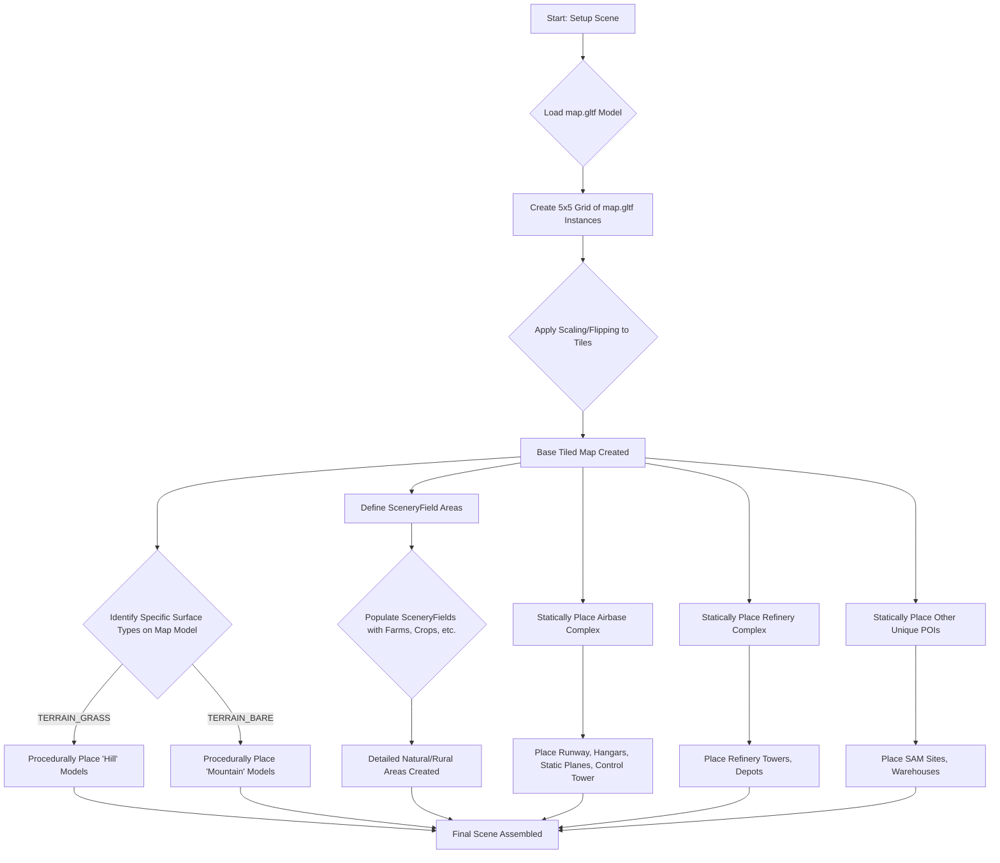

# Map Generation Process

The world generation in this project uses a hybrid approach, combining a pre-designed base map with procedurally and statically placed scenery elements.

## 1. Core Map Loading

The foundation of the game world is a 3D model named `map.gltf`, located in the `assets/` directory. This file contains the primary terrain, including its geometry, and initial UV mapping for textures.

The likely source file for `map.gltf` is `map.blend` found in the `data/` directory. This indicates that the map was designed using Blender, a 3D modeling software, and then exported to the `.gltf` format for use in the game.

### Tiling the Map

To create a larger and more varied game world than a single model instance would allow, the `src/script/state/game.ts` file implements a tiling mechanism within its `setupScene()` method. It loads the `map.gltf` model multiple times and arranges these instances in a 5x5 grid.

The relevant code snippet is:

```typescript
for (let x = -2; x <= 2; x++) {
    for (let z = -2; z <= 2; z++) {
        const model = this.models.getModel('assets/map.gltf');
        const map = new SimpleEntity(model, SceneLayers.Terrain, SceneLayers.Terrain);
        // Position the tile
        map.position.x = x * TERRAIN_MODEL_SIZE * TERRAIN_SCALE;
        map.position.z = z * TERRAIN_MODEL_SIZE * TERRAIN_SCALE;
        // Apply scaling, potentially flipping tiles for variation
        map.scale.x = TERRAIN_SCALE * (Math.abs(x) % 2 === 0 ? 1 : -1);
        map.scale.z = TERRAIN_SCALE * (Math.abs(z) % 2 === 0 ? 1 : -1);
        this.scene.add(map);
    }
}
```

This loop instantiates 25 copies of the base map. The `TERRAIN_MODEL_SIZE` and `TERRAIN_SCALE` constants (defined in `src/script/defs.ts`) control the dimensions and spacing of these tiles. The scaling logic also introduces variation by flipping some tiles along the X or Z axis based on their grid position (`Math.abs(x) % 2 === 0 ? 1 : -1`), which helps to break up repetition.

## 2. Procedural Placement of Additional Scenery

While the base terrain comes from the tiled `map.gltf` model, several types of scenery are placed procedurally to add detail and variation to the world.

### Hills and Mountains

After the base map tiles are loaded, the `setupScene()` method in `src/script/state/game.ts` populates the terrain with hills and mountains. This is not entirely random; these elements are placed onto specific surface types of the base map.

The code waits for the `assets/map.gltf` model to be fully loaded and then identifies meshes tagged with specific `PaletteCategory` types:

-   `PaletteCategory.TERRAIN_GRASS`: Hills (`lib:hill` model) are scattered across these areas.
-   `PaletteCategory.TERRAIN_BARE`: Mountains (`lib:mountain` model) are placed on these surfaces.

The `randomPosOver()` utility function is used to find suitable positions on these designated surfaces. It works by raycasting downwards from a random point within a specified spread to find an intersection with the surface. This ensures that the hills and mountains are placed on the terrain rather than floating or clipping through it.

```typescript
this.models.getModel('assets/map.gltf', (url, model) => {
    // Find the grass mesh from the loaded map model
    const grass = model.lod[0].flats.find(mesh => mesh.name === PaletteCategory.TERRAIN_GRASS);
    assertIsDefined(grass); // Ensure the mesh exists
    for (let i = 0; i < 30; i++) { // Place 30 hills
        const hill = new StaticSceneryEntity(this.models.getModel('lib:hill'));
        this.randomPosOver(grass, hill.position, 20000); // Place on grass, within a 20000 unit spread
        // Apply random scaling and rotation
        hill.scale.set(
            0.8 + Math.random() / 5.0,
            0.5 + Math.random() / 2.0,
            0.8 + Math.random() / 5.0);
        hill.quaternion.setFromAxisAngle(UP, Math.PI / 4 + (Math.random() - 0.5) * Math.PI / 4);
        this.scene.add(hill);
    }

    // Find the bare ground mesh
    const bare = model.lod[0].flats.find(mesh => mesh.name === PaletteCategory.TERRAIN_BARE);
    assertIsDefined(bare); // Ensure the mesh exists
    for (let i = 0; i < 20; i++) { // Place 20 mountains
        const mountain = new StaticSceneryEntity(this.models.getModel('lib:mountain'));
        this.randomPosOver(bare, mountain.position, 20000); // Place on bare ground
        // Apply random scaling and rotation
        mountain.scale.x = 0.8 + Math.random() / 5.0;
        mountain.scale.y = 0.5 + Math.random() / 2.0;
        mountain.scale.z = 0.8 + Math.random() / 5.0;
        mountain.quaternion.setFromAxisAngle(UP, Math.PI / 4 + (Math.random() - 0.5) * Math.PI / 4);
        this.scene.add(mountain);
    }
});
```
Each hill and mountain instance also receives randomized scaling and rotation to further enhance visual diversity.

### Scenery Fields

The game uses a `SceneryField` system (defined in `src/script/scene/entities/sceneryField.ts`) to populate larger areas with collections of smaller scenery objects. In `game.ts`, two such fields are created:

```typescript
const fieldOptions: SceneryFieldSettings = {
    tilesInField: 7,    // Number of tiles along each axis of the field
    cellsInTile: 2,     // Subdivisions within each tile
    tileLength: 2500.0, // Size of each tile in world units
    cellVariations: [   // Array defining what can spawn in a cell
        {
            probability: 0.4,
            model: 'assets/farm01.gltf', // 40% chance to spawn a farm
            jitter: 0.9,                 // Positional randomization factor
            randomRotation: true
        },
        {
            probability: 0.25,
            model: 'lib:cropGreen',      // 25% chance for green crops
            jitter: 1.2,
            randomRotation: false
        },
        // ... other crop variations
    ]
};
// Define the areas for the fields
const field1 = new SceneryField(this.models, new THREE.Box2().setFromCenterAndSize(new THREE.Vector2(0, 10000), new THREE.Vector2(80000, 10000)), fieldOptions);
this.scene.add(field1);
const field2 = new SceneryField(this.models, new THREE.Box2().setFromCenterAndSize(new THREE.Vector2(-10000, -10000), new THREE.Vector2(10000, 15000)), fieldOptions);
this.scene.add(field2);
```
The `SceneryFieldSettings` define the structure of the field (size, density) and a list of `cellVariations`. Each variation specifies a model to use (e.g., `assets/farm01.gltf`, `lib:cropGreen`), the probability of it appearing in a cell within the field, a "jitter" factor for slight positional adjustments, and whether it should be randomly rotated.

This system allows for creating diverse areas like farmlands by distributing various pre-made models according to defined probabilities and placement rules.

## 3. Statically Placed Elements

Beyond the tiled base map and procedurally scattered details, several key structures and points of interest are placed at fixed, hardcoded coordinates. These often represent unique locations or gameplay-relevant areas.

The `setupScene()` method in `src/script/state/game.ts` includes dedicated functions and direct instantiations for these:

### Airbase
An airbase is constructed using several static models. The `addAirBase()` method is responsible for this:
```typescript
private addAirBase(scene: Scene, models: ModelManager) {
    // Pavement sections
    const hangarGround1 = new StaticSceneryEntity(models.getModel('lib:pavement'), 5);
    hangarGround1.position.set(1360, 0, -860);
    // ... more pavement ...

    // Runway (a GroundTargetEntity, making it a potential target)
    const runway = new GroundTargetEntity(models.getModel('assets/runway01.gltf'), 0, 'Airbase', 'Stosneehar');
    runway.position.set(1500, 0, -800);
    scene.add(runway);

    // Hangars
    const hangar1 = new StaticSceneryEntity(models.getModel('assets/hangar01.gltf'));
    hangar1.position.set(1330, 0, -800);
    hangar1.quaternion.setFromAxisAngle(UP, Math.PI / 2); // Rotated
    // ... more hangars ...

    // Static aircraft models (scenery)
    const planes = [
        { p: new THREE.Vector3(1580, PLANE_DISTANCE_TO_GROUND, -840), r: -Math.PI / 2 },
        // ... more planes with positions and rotations ...
    ];
    planes.forEach(p => {
        const plane = new StaticSceneryEntity(models.getModel('assets/f22_scenery.glb'));
        plane.position.copy(p.p);
        plane.quaternion.setFromAxisAngle(UP, p.r);
        scene.add(plane);
        // ... and their shadows ...
    });

    // Control Tower
    const tower = new StaticSceneryEntity(models.getModel('assets/control01.gltf'));
    tower.position.set(1580, 0, -500);
    // ...
    scene.add(tower);
}
```
This function meticulously places pavement, the runway model, hangars, decorative aircraft, and a control tower at specific coordinates and orientations to form a complete airbase complex.

### Refinery
Similarly, the `addRefinery()` method assembles an oil refinery:
```typescript
private addRefinery(scene: Scene, models: ModelManager) {
    const x = -1200; // Base coordinates for this complex
    const z = 1500;
    // Main refinery structure (also a GroundTargetEntity)
    const refinery = new GroundTargetEntity(models.getModel('assets/refinery_towers01.gltf'), 2, 'Oil Refinery', 'Radlydd');
    refinery.position.set(x, 0, z);
    scene.add(refinery);

    // Depot models placed relative to the main structure
    const depot01a = new StaticSceneryEntity(models.getModel('assets/refinery_depot01.gltf'), 2);
    depot01a.position.set(x, 0, z - 100);
    // ... more depots with varying positions and orientations ...
    scene.add(depot01a);
}
```

### Other Unique Structures
Other individual structures are also placed directly:
-   **SAM Radar Site:**
    ```typescript
    const samradar = new GroundTargetEntity(this.models.getModel('assets/samradar01.glb'), 0, 'SAM Radar', 'Stosneehar');
    samradar.position.set(500, 0, -400);
    this.scene.add(samradar);
    ```
-   **Warehouse:**
    ```typescript
    const warehouse = new GroundTargetEntity(this.models.getModel('assets/hangar01.gltf'), undefined, 'Warehouse', 'Radlydd');
    warehouse.position.set(-16000, 0, 11000);
    warehouse.quaternion.setFromAxisAngle(UP, Math.PI / 2);
    this.scene.add(warehouse);
    ```

These statically placed elements ensure that important locations are consistently present and correctly assembled in the game world. Some, like the runway, refinery, and SAM site, are `GroundTargetEntity` instances, suggesting they have specific gameplay significance.

## 4. Visual Representation (Mermaid Diagram)



## 5. Summary of Map Generation

In summary, the world in this project is generated through a multi-stage, hybrid process:

1.  **Foundation from a Pre-designed Model:** A detailed base map (`map.gltf`), created externally (likely in Blender, based on `map.blend`), provides the fundamental terrain geometry and textures.
2.  **World Expansion via Tiling:** This single map model is tiled in a grid (5x5 instances) to create a much larger playable area. Minor variations like flipping tiles are used to reduce visual repetition.
3.  **Procedural Embellishment:**
    *   **Natural Features:** Hills and mountains are procedurally scattered onto specific material-defined areas (grass, bare ground) of the base map tiles, adding verticality and detail.
    *   **Area Population:** The `SceneryField` system populates defined rectangular zones with a probabilistic mix of smaller scenery models like farms and crops, creating varied agricultural or natural landscapes.
4.  **Static Placement of Key Locations:** Critical structures and points of interest, such as airbases, industrial refineries, and specific military installations (SAM sites), are explicitly placed at fixed coordinates with predefined orientations. These often serve as gameplay objectives or landmarks.

This approach balances the detailed control offered by pre-designed assets for the main terrain with the efficiency and variability of procedural techniques for adding widespread details and unique landmarks. It results in a large world that feels consistent yet contains unique, handcrafted areas and varied, procedurally generated scenery.
